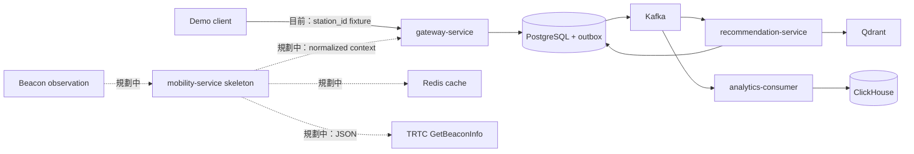

# Spacetime Node（時空節點）Architecture

> 狀態：進站 fixture → 推薦 → 兌換 → 分析主流程已完成；Beacon adapter 尚未實作，追蹤於 SCRUM-38。
> 詳細 MVP 設計與資料流見 [`docs/architecture.md`](../docs/architecture.md)。本文件是目前程式碼與目錄邊界的準則。

## Repository convention

根目錄只保留可直接啟動或識別專案的檔案。協作與 repository 治理文件統一置於 `.github/`，包括 `ARCHITECTURE.md`、未來的 `CONTRIBUTING.md`、`SECURITY.md`、issue template 與 workflow；產品設計、事件規格與操作手冊則放在 `docs/`。

## Scope

`spacetime-node` 是後端優先的捷運情境點數推薦 MVP。展示主流程為：

`station fixture 建立進站 -> 推薦 -> 兌換 -> 商家核銷 mock -> 成效分析`

目標流程會在 `station fixture` 前加入 Beacon 解析；目前不可把這段 planned flow 當成已完成能力。

PostgreSQL 是點數、庫存與兌換的唯一真實來源；Kafka 保存領域事件；ClickHouse 是可由 Kafka 重建的分析 projection；Qdrant 只提供優惠候選召回。

所有 API service 都提供 `/healthz`（process liveness）、`/readyz`（必要依賴 readiness）與 `/version`（版本資訊）。Readiness failure 應回 HTTP 503，不應用靜態 200 掩蓋 DB、Qdrant 或其他必要依賴不可用。

## Service boundaries

| Component | Responsibility | Owns |
| --- | --- | --- |
| `gateway-service` | Demo HTTP API、User profile/preferences、建立 journey、寫入 entry event | 入口協調，不承載推薦或交易規則 |
| `mobility-service` | 目前只有 health/version 服務骨架；預計成為北捷 Beacon API 的 anti-corruption layer | 尚未擁有業務資料；未來封裝捷運帳密、外部格式與 station/position context |
| `recommendation-service` | Qdrant 候選召回、PostgreSQL 驗證、規則排序、受控文案 | recommendation records 與 explainability |
| `embedding-indexer` | 消費 `offer.changed.v1`、產生 embedding、更新 Qdrant | `offer_embeddings_v1` 可重建索引 |
| `redemption-service` | 點數扣除、庫存保留、冪等兌換、核銷 mock、outbox | points ledger、inventory、redemptions |
| `analytics-consumer` | 消費產品事件並寫入 ClickHouse | 分析 projection；不是交易真實來源 |

`mobility-service` 將是唯一可直接呼叫北捷服務的元件，但 provider client 尚未實作。Beacon 帳密只可存在這個服務的執行期秘密設定，不能進入 Git、log、Kafka 或 trace。

Beacon 回應的 `STATIONID` 是跨轉乘線的站點主鍵，`SID` 與 `LID` 保留線別脈絡，`POSINO`/`POSITION` 只能當作鄰近出口推薦的加分訊號，不能作為點數或兌換的信任依據。

## Runtime flow



目前 Gateway 直接接收 `station_id` 後記錄 `journey.entered`，推薦由 Kafka event 非同步觸發。目標流程才會先透過 `mobility-service` 解析 Beacon；外部服務失敗時必須退回 cached／station-level fixture，且不能阻塞推薦或兌換。

`redemption-service` serializes a user's redemption attempts by locking the user row before checking `Idempotency-Key`, then locks the target inventory row in the same transaction. A replay with the same journey and offer returns the original redemption; reuse for different inputs returns a conflict. The successful transaction also appends a `redemption.succeeded.v1` envelope to PostgreSQL outbox; a Kafka publisher marks it sent only after Kafka accepts it. Consumer side effects run with a `processed_events` insert in one transaction, so replays are skipped.

## Contracts and events

- `api/proto/spacetime_node/v1/` is the source for internal gRPC and generated demo HTTP/OpenAPI contracts. `journey.proto` defines entry/recommendation reads, `redemption.proto` defines redemption writes/reads, and `errors.proto` fixes client-visible failure reasons. Run `make proto` after a contract change.
- `api/events/v1/events.schema.json` is the versioned Kafka envelope and topic payload source; `api/events/v1/README.md` fixes producer, consumer, partition-key, replay, and compatibility rules.
- `api/openapi/openapi.yaml` is generated from Proto by `make openapi`; `api/schemas/` holds CopyGenerator JSON Schemas.
- Every event carries `event_id`, `trace_id`, `causation_id`, `journey_id`, `schema_version`, and only a hashed user identifier.
- Recommendation decisions persist the selected copy source plus a candidate summary (vector score, rule score, eligibility, and reasons); the latest-recommendation API exposes the selected result, explainability, copy source, and decision latency.
- `recommendation.OfferIndexer` bootstraps `offer_embeddings_v1`, indexes station/category/version payloads, and treats `offer.changed.v1` as the rebuildable Qdrant write contract; PostgreSQL remains the offer source of truth.
- Initial topics: `journey.entered.v1`, `recommendation.created.v1`, `notification.sent.v1`, `notification.delivered.v1`, `recommendation.impressed.v1`, `recommendation.clicked.v1`, `redemption.succeeded.v1`, `merchant.verified.v1`, `visit.attributed.v1`, `offer.changed.v1`, and `dlq.v1`.

## File structure

```text
.
├── .github/
│   ├── ARCHITECTURE.md             # 此架構與 repository 規範
│   └── workflows/
│       └── ci.yml                 # Go module hygiene on push / pull request
├── api/
│   ├── events/                    # Versioned Kafka schema and example payloads
│   ├── openapi/                   # Generated OpenAPI output (not hand-edited)
│   ├── proto/spacetime_node/v1/   # Proto source of truth
│   └── schemas/                   # CopyGenerator JSON Schema contracts
├── cmd/
│   ├── analytics/                 # analytics-consumer executable
│   ├── gateway/                   # gateway-service executable
│   ├── embedding-indexer/          # offer.changed.v1 -> Qdrant worker
│   ├── mobility/                  # mobility-service executable
│   ├── recommendation/            # recommendation-service executable
│   └── redemption/                # redemption-service executable
├── configs/                       # Non-secret local configuration templates
├── deploy/
│   ├── compose/                   # Docker Compose and environment wiring
│   ├── grafana/                   # ClickHouse datasource and business dashboard provisioning
│   └── observability/             # OTel Collector / LGTM configuration
├── docs/
│   ├── adr/                       # Architecture decision records
│   ├── events/                    # Topic, key, replay, and DLQ documentation
│   └── runbooks/                  # Demo and failure-recovery procedures
├── internal/
│   ├── analytics/                 # ClickHouse projections and consumers
│   ├── journey/                   # Gateway journey handlers and orchestration
│   ├── mobility/
│   │   └── provider/metro/        # Reserved; Beacon provider adapter not implemented yet
│   ├── platform/
│   │   ├── app/                   # Kratos HTTP/gRPC bootstrap and health endpoints
│   │   ├── config/                # Shared typed environment/configuration loading
│   │   ├── outbox/                # Kafka publisher and transactional consumer deduplication
│   │   └── observability/         # OTel setup and safe log fields
│   ├── recommendation/            # Retrieval, rule ranking, copy fallback
│   ├── redemption/                # Ledger, inventory, outbox, verification mock
│   └── user/                      # User profile and persisted preference API
├── migrations/
│   └── postgres/                  # Ordered schema + deterministic demo seed
├── scripts/                       # Repeatable local seed, demo, and verification commands
├── test/
│   └── fixtures/metro/            # Reserved; sanitised Beacon fixture planned by SCRUM-38
├── .env.example                   # Non-secret local environment template
├── Dockerfile                      # One parameterised image for all service binaries
├── Makefile                        # Reproducible Proto stub generation
├── README.md
└── go.mod
```

## Delivery sequence

1. **Sprint 0**: create Kratos entry points, Proto/event contracts, Compose dependencies, migrations, fixtures, and local configuration.
2. **Sprint 1**: asynchronous recommendation flow 已完成；Beacon resolution、Redis cache 與 fallback 尚待 SCRUM-38。
3. **Sprint 2**: add route/arrival/crowding enrichment only as optional context; implement redemption, ClickHouse projection, and LGTM signals.
4. **Sprint 3**: run the reproducible demo, contract/idempotency/fallback tests, and preserve performance plus business-KPI evidence.

## Explicit non-goals for the scaffold

- No shared domain package across services: contracts and duplicated small types are preferable to premature coupling.
- No provider credentials in source, fixtures, logs, Kafka events, or traces.
- No user vectors in Qdrant until a measured retrieval problem requires them; structured station, budget, category, and push-window settings stay in PostgreSQL.
- No direct external API call from gateway, recommendation, or redemption code.
