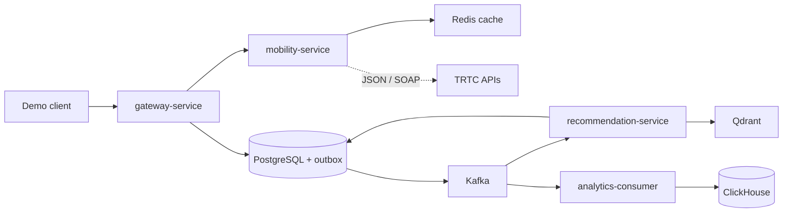

# Spacetime Node（時空節點）Architecture

> 狀態：Sprint 0 初始化基線  
> 詳細 MVP 設計與資料流見 [`docs/architecture.md`](../docs/architecture.md)。本文件是目前程式碼與目錄邊界的準則。

## Repository convention

根目錄只保留可直接啟動或識別專案的檔案。協作與 repository 治理文件統一置於 `.github/`，包括 `ARCHITECTURE.md`、未來的 `CONTRIBUTING.md`、`SECURITY.md`、issue template 與 workflow；產品設計、事件規格與操作手冊則放在 `docs/`。

## Scope

`spacetime-node` 是後端優先的捷運情境點數推薦 MVP。展示主流程為：

`Beacon 解析進站位置 -> 推薦 -> 兌換 -> 商家核銷 mock -> 成效分析`

PostgreSQL 是點數、庫存與兌換的唯一真實來源；Kafka 保存領域事件；ClickHouse 是可由 Kafka 重建的分析 projection；Qdrant 只提供優惠候選召回。

## Service boundaries

| Component | Responsibility | Owns |
| --- | --- | --- |
| `gateway-service` | Demo HTTP API、建立 journey、寫入 entry event | 入口協調，不承載推薦或交易規則 |
| `mobility-service` | 北捷 Beacon/ SOAP API 的 anti-corruption layer、站點脈絡與快取 | 捷運帳密、外部 API 格式、station/position context |
| `recommendation-service` | Qdrant 候選召回、PostgreSQL 驗證、規則排序、受控文案 | recommendation records 與 explainability |
| `redemption-service` | 點數扣除、庫存保留、冪等兌換、核銷 mock、outbox | points ledger、inventory、redemptions |
| `analytics-consumer` | 消費產品事件並寫入 ClickHouse | 分析 projection；不是交易真實來源 |

`mobility-service` 是唯一可直接呼叫北捷服務的元件。Beacon API 使用 JSON；其餘捷運資料多為 SOAP XML。帳密只可存在這個服務的執行期秘密設定，不能進入 Git、log、Kafka 或 trace。

Beacon 回應的 `STATIONID` 是跨轉乘線的站點主鍵，`SID` 與 `LID` 保留線別脈絡，`POSINO`/`POSITION` 只能當作鄰近出口推薦的加分訊號，不能作為點數或兌換的信任依據。

## Runtime flow



The synchronous path is deliberately short: Gateway resolves a Beacon through `mobility-service`, then records `journey.entered`. Recommendation is triggered asynchronously from the Kafka event. If real-time metro enrichment fails or exceeds its deadline, the system falls back to cached/station-level context; it must never block redemption.

## Contracts and events

- `api/proto/spacetime_node/v1/` is the source for internal gRPC and generated demo HTTP/OpenAPI contracts. `common.proto` currently defines correlation context only; service contracts are introduced with their owning Sprint work.
- `api/events/` holds versioned Kafka payload examples and schemas.
- Every event carries `event_id`, `trace_id`, `causation_id`, `journey_id`, `schema_version`, and only a hashed user identifier.
- Initial topics: `journey.entered.v1`, `recommendation.created.v1`, `redemption.succeeded.v1`, `merchant.verified.v1`, `offer.changed.v1`, and `dlq.v1`.

## File structure

```text
.
├── .github/
│   ├── ARCHITECTURE.md             # 此架構與 repository 規範
│   └── workflows/
│       └── ci.yml                 # Go module hygiene on push / pull request
├── api/
│   ├── events/                    # Versioned Kafka schema and example payloads
│   ├── openapi/                   # Generated OpenAPI output (not hand-edited)
│   └── proto/spacetime_node/v1/   # Proto source of truth
├── cmd/
│   ├── analytics/                 # analytics-consumer executable
│   ├── gateway/                   # gateway-service executable
│   ├── mobility/                  # mobility-service executable
│   ├── recommendation/            # recommendation-service executable
│   └── redemption/                # redemption-service executable
├── configs/                       # Non-secret local configuration templates
├── deploy/
│   ├── compose/                   # Docker Compose and environment wiring
│   └── observability/             # OTel Collector / LGTM configuration
├── docs/
│   ├── adr/                       # Architecture decision records
│   ├── events/                    # Topic, key, replay, and DLQ documentation
│   └── runbooks/                  # Demo and failure-recovery procedures
├── internal/
│   ├── analytics/                 # ClickHouse projections and consumers
│   ├── gateway/                   # HTTP handlers and journey orchestration
│   ├── mobility/
│   │   └── provider/metro/        # JSON Beacon + SOAP client adapters only
│   ├── platform/
│   │   ├── app/                   # Kratos HTTP/gRPC bootstrap and health endpoints
│   │   ├── config/                # Shared typed environment/configuration loading
│   │   ├── events/                # Kafka envelope, producer/consumer support
│   │   └── observability/         # OTel setup and safe log fields
│   ├── recommendation/            # Retrieval, rule ranking, copy fallback
│   └── redemption/                # Ledger, inventory, outbox, verification mock
├── migrations/
│   ├── mobility/                  # Station catalogue / integration state
│   ├── recommendation/            # Offer and recommendation records
│   └── redemption/                # Points, inventory, redemption, outbox
├── scripts/                       # Repeatable local seed, demo, and verification commands
├── test/
│   └── fixtures/metro/            # Sanitised Beacon / SOAP response fixtures
├── .env.example                   # Non-secret local environment template
├── Dockerfile                      # One parameterised image for all service binaries
├── README.md
└── go.mod
```

## Delivery sequence

1. **Sprint 0**: create Kratos entry points, Proto/event contracts, Compose dependencies, migrations, fixtures, and local configuration.
2. **Sprint 1**: implement Beacon resolution with Redis cache and fallback, then connect it to the asynchronous recommendation flow.
3. **Sprint 2**: add route/arrival/crowding enrichment only as optional context; implement redemption, ClickHouse projection, and LGTM signals.
4. **Sprint 3**: run the reproducible demo, contract/idempotency/fallback tests, and preserve performance plus business-KPI evidence.

## Explicit non-goals for the scaffold

- No shared domain package across services: contracts and duplicated small types are preferable to premature coupling.
- No generated Kratos code, schema migration, or provider credentials yet. Each belongs to a Sprint 0 subtask and will be added with a runnable check.
- No direct external API call from gateway, recommendation, or redemption code.
