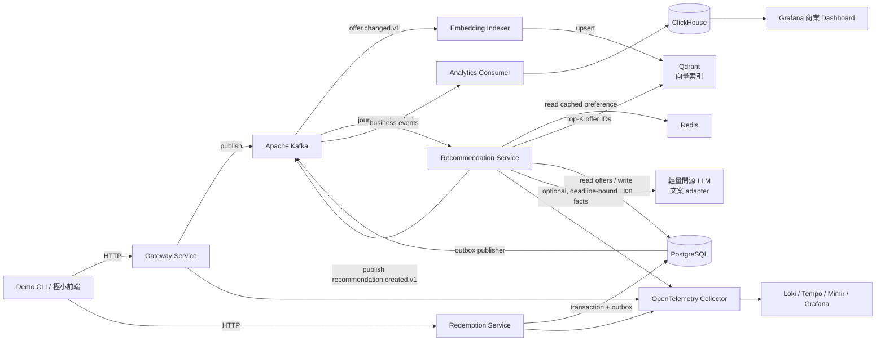
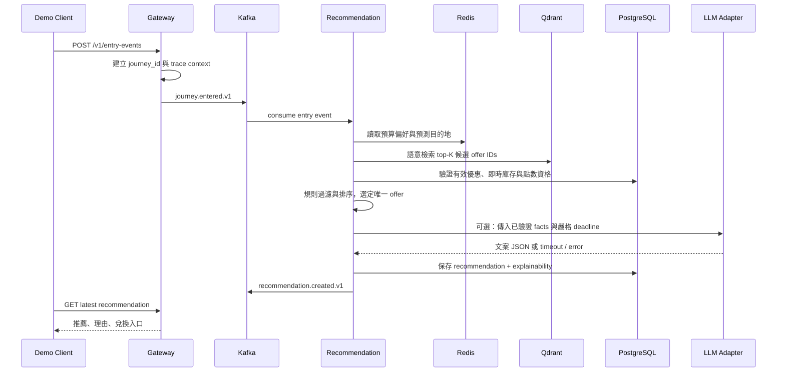

# Spacetime Node（時空節點）後端 MVP 架構文件

> **目前程式碼服務邊界與目錄結構以 [`.github/ARCHITECTURE.md`](../.github/ARCHITECTURE.md) 為準。** 本文件保留完整的 MVP 設計脈絡；其中較早的三服務描述已由 `mobility-service` 的外部捷運 API 邊界補充。

> 版本：0.1  
> 狀態：提案／MVP 實作基線  
> 專案代號：`spacetime-node`  
> 對應 Jira Epic：[SCRUM-5](https://hajimi-o.atlassian.net/browse/SCRUM-5)

## 1. 專案目標

「時空節點」是一個面向台北捷運通勤情境的個人化點數推薦後端。系統在使用者進站事件發生後，結合預先計算的偏好、站點、時段與可兌換優惠，在兩秒內產生可解釋的推薦；使用者接著可完成兌換，並將曝光、點擊、兌換、核銷等資料轉化成可驗證的商業成效。

本專題的首要目標是完成可穩定展示的後端 MVP，而不是模擬完整北捷正式系統。

### MVP 成功條件

- 可用一個 `docker compose up` 啟動所有 demo 所需元件。
- 可完成「進站 → 推薦 → 兌換 → 核銷模擬 → 成效 dashboard」的端對端流程。
- 在本機受控 demo 環境中，進站至推薦結果產生的 P95 延遲小於 2 秒。
- 每個關鍵動作都能以 `journey_id`、`recommendation_id`、`event_id` 與 `trace_id` 追溯。
- Dashboard 同時呈現技術健康度與商業轉換漏斗。

### 非目標

下列項目不屬於 MVP 必要範圍，僅保留可擴充介面或 mock：

- 真實北捷閘門、會員、票務與站點 API。
- FCM/APNs 真實推播、真實商家 POS 與實體到店定位。
- 完整向量資料庫、RAG、embedding 訓練與 GPU 部署。
- 多區高可用、Kubernetes、生產級 Kafka 叢集。
- 面向終端使用者的完整前端。

## 2. 核心設計原則

1. **MVP 優先，但保留正確演進路徑**：只實作 demo 需要的能力；服務邊界、事件契約和可觀測性則依正式系統原則設計。
2. **Contract-first**：HTTP、gRPC 與 Kafka 的資料格式先定義，再寫實作；Proto 與版本化事件 schema 是跨服務的真實契約。
3. **交易與事件分責**：PostgreSQL 是點數、庫存、兌換的強一致性真實來源；Kafka 是可重播的領域事件紀錄。
4. **可解釋推薦優先於模型複雜度**：向量檢索只召回候選，規則排序決定最終優惠；LLM 只能根據已驗證 facts 美化文案，不能決定優惠、點數、資格、庫存或交易結果。
5. **商業成效與技術維運分流**：產品事件進 ClickHouse 做轉換分析；logs、metrics、traces 進 LGTM 做系統維運。
6. **隱私預設保護**：事件、logs、traces 不寫入原始使用者識別資料；使用 hash 或受控的 surrogate ID。

## 3. 系統總覽



## 4. 服務邊界

MVP 採用四個 API 服務與獨立 worker；不依照原始構想拆成七個服務，避免單人開發時把成本耗在網路呼叫、設定與部署上。

| 服務 | 責任 | 對外／對內介面 | MVP 不做什麼 |
|---|---|---|---|
| `gateway-service` | 接收模擬進站、提供查詢推薦等 BFF API、建立旅程識別 | HTTP；發布 Kafka | 真實閘門／北捷會員介接 |
| `recommendation-service` | 讀取偏好快取、向量召回候選、規則篩選與排序、保存推薦 | Kafka consumer、gRPC／HTTP（內部） | 真正模型訓練、讓 LLM 決策 |
| `embedding-indexer` | 消費優惠變更事件、產生 embedding、更新 Qdrant 可重建索引 | Kafka consumer | 正式模型訓練與 GPU serving |
| `redemption-service` | 點數扣除、庫存保留、兌換單、核銷 mock、outbox | HTTP／gRPC；發布 Kafka | 真實 POS、支付與退款流程 |
| `analytics-consumer` | 消費產品事件、寫入 ClickHouse、產出漏斗資料 | Kafka consumer | 線上推薦決策 |

`analytics-consumer` 可以先作為獨立 worker，而不是完整 Kratos 對外服務。這樣仍能展示 consumer group、事件解耦和資料投影。

## 5. 技術選型

| 類別 | 選擇 | 角色與理由 |
|---|---|---|
| 語言 | Go | 單人可維護、併發處理適合事件 consumer、部署單純 |
| 微服務框架 | Kratos | Proto contract-first、HTTP / gRPC、middleware 與服務骨架 |
| 非同步事件 | Apache Kafka（KRaft） | 可保留、重播與分組消費的事件骨幹；MVP 使用單 broker |
| 交易資料庫 | PostgreSQL | 點數、庫存、兌換所需的交易、約束與冪等性 |
| 分析資料庫 | ClickHouse | 事件漏斗、分群、時間序列聚合與 dashboard 查詢 |
| 快取 | Redis | 預算偏好、去重、短期節流與熱資料 |
| 向量資料庫 | Qdrant | 優惠／商家語意候選召回；只保存可重建索引，不是真實交易來源 |
| LLM | 輕量開源 instruct model，經 adapter 呼叫 | 僅生成受控繁中推薦文案；可在本機或相容 API 執行 |
| API 規格 | Proto + OpenAPI / Swagger UI | 單一契約來源；避免手寫重複文件 |
| 可觀測性 | OpenTelemetry + LGTM | 從開發版 collector 演進至 Loki、Grafana、Tempo、Mimir |
| 本機部署 | Docker Compose | 評審可重現、環境依賴可控 |

### 資料來源責任

PostgreSQL 的交易異動先透過 transactional outbox 發成 Kafka 領域事件。`analytics-consumer` 消費事件後寫入 ClickHouse，因此 ClickHouse 是可重播重建的分析 projection，而非 recommendation service 的同步讀取來源。

Qdrant 同樣是可重建的衍生索引：`offer.changed.v1` 由 embedding indexer 消費，生成／更新優惠向量。推薦服務只從 Qdrant 取得候選 `offer_id`，再回 PostgreSQL 檢查即時庫存、有效期、點數與資格。

### 為何不把 MongoDB / Cassandra 放進 MVP

- **MongoDB**：若未來增加多輪聊天、非結構化 LLM 對話紀錄或外部原始文件，可作為選項；目前核心資料有明確交易一致性需求，並不適合當主資料庫。
- **Cassandra**：適用於極大量、固定查詢模式的分散式寫入場景。MVP 的點數交易與資料分析規模都不需要它，導入只會增加資料建模和叢集維運成本。

## 6. API 與事件契約

### 6.1 對外 HTTP API（第一版）

| 方法 | 路徑 | 用途 |
|---|---|---|
| `POST` | `/v1/entry-events` | 模擬使用者在指定站點進站，建立旅程並觸發推薦 |
| `GET` | `/v1/recommendations/latest?journey_id=...` | 取得最新推薦結果 |
| `POST` | `/v1/redemptions` | 建立兌換；請求需有 `Idempotency-Key` |
| `GET` | `/v1/redemptions/{redemption_id}` | 查詢兌換與核銷狀態 |
| `POST` | `/v1/merchant-verifications` | 模擬商家 POS 核銷 |
| `GET` | `/healthz` | health check |

HTTP 是 demo 與外部呼叫入口；服務內部需要同步協作時使用 gRPC。所有 API 的 request / response 由 `.proto` 產生，並輸出 OpenAPI 規格與 Swagger UI。

### 6.2 共用事件信封

每個 Kafka event 都使用相同欄位，payload 依 event type 擴充：

```json
{
  "event_id": "01J...",
  "event_type": "recommendation.created.v1",
  "schema_version": 1,
  "occurred_at": "2026-07-24T14:00:00Z",
  "producer": "recommendation-service",
  "user_id_hash": "sha256:...",
  "journey_id": "journey_...",
  "recommendation_id": "rec_...",
  "trace_id": "...",
  "causation_id": "event that caused this event",
  "payload": {}
}
```

`event_id` 用於去重；`causation_id` 用於建立事件因果鏈；`trace_id` 用於從商業事件跳回技術 trace。

### 6.3 Kafka topics

| Topic | Producer | Consumer | Key | 用途 |
|---|---|---|---|---|
| `journey.entered.v1` | gateway | recommendation | `user_id_hash` | 進站觸發 |
| `recommendation.created.v1` | recommendation | notification mock、analytics | `user_id_hash` | 推薦已產生 |
| `notification.sent.v1` | notification mock | analytics | `user_id_hash` | 推播送出 |
| `notification.delivered.v1` | notification mock | analytics | `user_id_hash` | 供應商／裝置確認送達 |
| `recommendation.impressed.v1` | demo client | analytics | `user_id_hash` | 使用者實際看到內容 |
| `recommendation.clicked.v1` | demo client | analytics | `user_id_hash` | 使用者開啟或點擊 |
| `redemption.succeeded.v1` | redemption | analytics | `user_id_hash` | 兌換交易成功 |
| `merchant.verified.v1` | merchant mock | analytics | `journey_id` | 商家核銷，最強轉換證據 |
| `offer.changed.v1` | offer administration / seed importer | embedding indexer | `offer_id` | 更新可重建的優惠向量索引 |
| `dlq.v1` | 各 consumer | 維運人員 | 原 event key | 失敗事件保留與人工檢查 |

同一個 `user_id_hash` 會寫入同一 partition，確保同一使用者的進站、推薦與兌換順序在該 partition 內一致。不同 consumer group 可獨立消費相同事件：推薦、分析與可觀測性不互相阻塞。

## 7. 資料設計

### 7.1 PostgreSQL：交易真實來源

| 資料表 | 目的 |
|---|---|
| `users` | demo 使用者、點數餘額摘要與偏好 reference |
| `points_ledger` | 不可變點數帳本，記錄增加、扣除與原因 |
| `offers` | 優惠內容、所屬站點／商家、有效期間、成本與標籤 |
| `inventory` | 每個優惠剩餘數量與版本號 |
| `recommendations` | 推薦結果、決策理由、候選與分數摘要 |
| `redemptions` | 兌換單、冪等 key、狀態與核銷資訊 |
| `outbox_events` | 與業務資料同 transaction 寫入、等待發布的事件 |
| `processed_events` | consumer 已處理事件 ID，用於冪等去重 |

### 7.2 Redis：可重建的暫存資料

推薦服務讀取下列 key；資料遺失後可由 seed data 或離峰預計算重新建立，因此不視為真實來源。

```text
preference:{user_id_hash}   # 預測目的地、偏好標籤、有效到期時間
dedupe:{event_id}           # 短期事件去重
rate_limit:{user_id_hash}   # 推播／推薦節流
```

### 7.3 ClickHouse：商業分析資料

`product_events` 是 append-only 事件表，保留原始產品行為；可依日期、站點、優惠、商家、experiment 與 variant 聚合。

建議的核心欄位：

```text
occurred_at, event_name, journey_id, recommendation_id,
user_id_hash, station_id, offer_id, merchant_id,
experiment_id, variant, attribution_type, trace_id
```

`attribution_type` 至少區分：

- `observed_pos_verified`：商家 POS mock／真實核銷確認，屬於事實。
- `inferred_visit`：以取得同意的訊號推估到店，屬於估計，不能和核銷混為同一 KPI。
- `none`：尚未有足夠證據歸因。

### 7.4 Qdrant：優惠語意索引

Qdrant collection `offer_embeddings_v1` 以 `offer_id` 作為 point ID，保存由優惠名稱、描述、標籤與商家類型產生的 embedding。payload 可包含 `station_ids`、`category`、`merchant_id`、`content_version` 與 `embedding_model`，用於縮小候選集。

不應將庫存、點數餘額或兌換資格當作 Qdrant 的可靠決策資料；這些資訊即使複製到 payload，也只能作為預篩選，最終必須回 PostgreSQL 驗證。

優惠內容更新時發布 `offer.changed.v1`，由 `embedding-indexer` 產生 embedding 後 upsert。換 embedding model 時建立新 collection，例如 `offer_embeddings_v2`，完整重建與驗證後再切換讀取設定。

## 8. 一致性與失敗處理

### 8.1 Transactional outbox

兌換成功時，不能先寫資料庫再直接送 Kafka，否則可能發生「DB 已扣點但 Kafka 發送失敗」。解法：在同一筆 PostgreSQL transaction 中完成：

1. 驗證 `Idempotency-Key`。
2. 鎖定點數與庫存資料。
3. 建立 `redemptions`、寫入 `points_ledger`、更新 `inventory`。
4. 寫入 `outbox_events`。
5. commit。
6. outbox publisher 非同步讀取未送出資料、發布到 Kafka，成功後標記為已送。

如此即使 Kafka 或 publisher 暫時失敗，事件仍留在資料庫中可重試；而 consumer 以 `event_id` 寫入 `processed_events` 達成 at-least-once 下的冪等處理。

### 8.2 重試與 DLQ

- 可恢復錯誤（網路、短暫 DB 失敗）採指數退避重試。
- 不可恢復錯誤（schema 不相容、缺少必要欄位）送往 `dlq.v1`。
- DLQ event 必須保留原 event、失敗原因、consumer 名稱與重試次數。
- demo 只需能觀察與手動重播；不必建置完整營運後台。

## 9. 推薦決策流程



### MVP 排序規則

推薦結果必須附帶可解釋理由。初版可採固定權重：

```text
final_score =
  0.35 * preference_match +
  0.25 * point_roi +
  0.20 * station_proximity +
  0.10 * time_context +
  0.10 * inventory_urgency
```

硬性過濾條件：優惠已過期、無庫存、點數不足、使用者不符合資格時，一律不可送入排序。

### 9.1 LLM 文案生成規範

LLM 若啟用，只能將「最終已選定優惠 + 可使用的結構化情境」轉成推薦文案。它使用輕量開源 instruct model，經 `CopyGenerator` adapter 呼叫；模型可替換，業務服務不得依賴特定供應商。

輸入只提供結構化 facts，例如站點、已選優惠名稱、已驗證折抵、點數、情境與語氣。輸出必須符合固定 JSON schema：`title`、`body`、`tone`。輸出長度受限，且不得新增未提供的商家、價格、點數、有效期或資格資訊。

推薦服務必須先生成確定可用的模板文案。LLM 僅能在嚴格 deadline 內嘗試改寫；超時、錯誤、JSON 不合法、內容違反 facts 或安全規則時，一律回退為模板，不能阻斷兩秒 SLA 或改變推薦結果。

LLM 不負責：候選召回、最終排序、目的地預測、庫存／點數驗證、扣點、交易狀態或商業 KPI 判定。

## 10. 可觀測性與商業分析

### 10.1 技術可觀測性：OpenTelemetry + LGTM

每個 HTTP request、gRPC call、Kafka producer 與 consumer 都傳遞 trace context。結構化 log 至少包含：

```text
timestamp, level, service_name, trace_id, span_id,
journey_id, recommendation_id, event_id, message, error_code
```

監控指標：

- **RED**：request rate、error rate、duration（P50 / P95 / P99）。
- **Kafka**：consumer lag、重試數、DLQ 數、publish / consume 延遲。
- **推薦**：端到端延遲、Redis 命中率、候選數、各規則淘汰數、LLM fallback 次數。
- **交易**：兌換成功／失敗率、點數不足、庫存不足、冪等命中數、outbox backlog。

本機先使用單一 `grafana/otel-lgtm` 開發容器；未來可拆為 OTel Collector、Loki、Tempo、Mimir 與 Grafana。

### 10.2 LLM 可觀測性

若啟用 LLM adapter，記錄：

- model 名稱、prompt template version、temperature。
- input / output token 數、延遲、估計成本。
- retriever candidate IDs、最終選取優惠、schema validation 與 fallback 原因。
- 安全過濾結果與錯誤碼。

不得記錄完整 prompt、使用者原始身分、敏感位置歷史或 API key。

### 10.3 商業 KPI 與歸因

| 層級 | 事件 | 定義 |
|---|---|---|
| 投遞 | `notification.sent` / `notification.delivered` | 推播已送出／供應商或裝置確認送達 |
| 曝光 | `recommendation.impressed` | 使用者實際看到推薦內容 |
| 互動 | `recommendation.clicked` | 使用者點擊或開啟兌換頁 |
| 交易 | `redemption.succeeded` | 點數扣除與兌換單建立成功 |
| 到店 | `merchant.verified` | 商家核銷確認；最強轉換證據 |

為了區分相關性與因果效果，產品事件必須攜帶 `experiment_id` 與 `variant`。例如保留 10% 符合資格者為 holdout group、不推播，再比較兩組核銷率；這才能估算推播帶來的增量，而非只報告「收到推播的人比較常兌換」。

## 11. 本機部署與設定

Docker Compose 應包含：

```text
gateway-service
recommendation-service
redemption-service
analytics-consumer
kafka (KRaft, single broker)
postgres
redis
clickhouse
qdrant
otel-lgtm
```

環境設定由 `.env.example` 描述。任何秘密資訊都不能進入 Git；MVP 預設使用 mock weather、mock notification、mock merchant verification，不需第三方憑證。

LLM endpoint 也必須由設定注入。基礎 Compose 預設以 template / mock CopyGenerator 跑完整流程，不強制下載或啟動大型模型；需要展示 AI 時再指向本機輕量開源模型或相容 API。這可確保硬體條件不足、模型逾時或模型服務故障時，核心 demo 仍可運作。

## 12. 開發順序

對應 Jira 的建議執行順序：

1. [SCRUM-6](https://hajimi-o.atlassian.net/browse/SCRUM-6)：Kratos mono-repo 與 Compose。
2. [SCRUM-7](https://hajimi-o.atlassian.net/browse/SCRUM-7)：Proto、OpenAPI、topic 與 schema。
3. [SCRUM-8](https://hajimi-o.atlassian.net/browse/SCRUM-8)：交易模型、migration、seed、outbox。
4. [SCRUM-9](https://hajimi-o.atlassian.net/browse/SCRUM-9)：進站到推薦。
5. [SCRUM-10](https://hajimi-o.atlassian.net/browse/SCRUM-10)：兌換到核銷模擬。
6. [SCRUM-11](https://hajimi-o.atlassian.net/browse/SCRUM-11)：ClickHouse 漏斗與商業 dashboard。
7. [SCRUM-12](https://hajimi-o.atlassian.net/browse/SCRUM-12)：OTel 與 LGTM。
8. [SCRUM-13](https://hajimi-o.atlassian.net/browse/SCRUM-13)：端對端 demo、測試、壓測與交付。

## 13. Demo 劇本

1. 執行 `docker compose up`，確認 services、Kafka、資料庫與 Grafana 健康。
2. 使用 demo user 在「信義安和站」送出進站事件。
3. 顯示 gateway 回傳的 `journey_id`，並在 Swagger UI／CLI 查詢推薦。
4. 顯示推薦理由：使用者偏好、時段、站點、向量候選與點數 ROI；同時展示模板文案或通過 schema 驗證的 LLM 文案。
5. 建立 redemption，展示點數帳本、庫存與 outbox event。
6. 透過 merchant mock 核銷。
7. 開啟 Grafana：
   - ClickHouse dashboard 顯示旅程與漏斗。
   - Tempo trace 顯示跨 gateway、Kafka、recommendation、redemption 的處理鏈。
   - metrics 顯示推薦延遲、consumer lag 與錯誤率。

## 14. MVP 驗收清單

- [ ] 任一開發者可依 README 成功啟動環境。
- [ ] API 文件可從 Swagger UI 瀏覽與操作。
- [ ] 進站事件可觸發 Kafka 消費與推薦建立。
- [ ] 推薦有可讀理由且不推薦過期、無庫存或點數不足優惠。
- [ ] Qdrant 僅負責候選召回；最終優惠均已回 PostgreSQL 驗證。
- [ ] LLM 只能根據已驗證 facts 生成 JSON 文案，失敗時自動使用模板且不影響推薦結果。
- [ ] 兌換交易可防止重複扣點，並使用 transactional outbox 發布事件。
- [ ] ClickHouse 可查到完整漏斗事件；Grafana 可顯示核心商業 KPI。
- [ ] Tempo trace 可連結關鍵服務與 Kafka 處理；logs 不含 PII。
- [ ] Demo 不依賴真實北捷、POS、FCM/APNs 或 LLM API。

## 15. 後續演進方向

- 使用 CWA 天氣 API 替換 mock context provider。
- 加入 pgvector 或獨立 vector store，將 `OfferRetriever` 替換為 RAG 召回。
- 接上真實推播與 POS adapter；保持 event schema 不變。
- 將 analytics consumer 擴展為 A/B test、商家報表與成本／ROI 模型。
- 將單機 Compose 演進至 Kubernetes、Kafka 多 broker、資料庫備援與正式 LGTM 部署。
