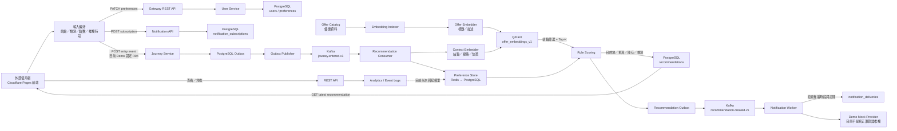

```mermaid
flowchart LR
    U["外部使用者<br/>Cloudflare Pages 前端"] --> P["輸入偏好<br/>站點／類別／點數／推播時段"]

    P -->|PATCH preferences| G["Gateway REST API"]
    G --> US["User Service"]
    US --> PG["PostgreSQL<br/>users / preferences"]

    P -->|POST subscription| NS["Notification API"]
    NS --> PGN["PostgreSQL<br/>notification_subscriptions"]

    P -->|POST entry event<br/>目前 Demo 固定 R04| JS["Journey Service"]
    JS --> O1["PostgreSQL Outbox"]
    O1 --> OP["Outbox Publisher"]
    OP --> K1["Kafka<br/>journey.entered.v1"]

    K1 --> RC["Recommendation Consumer"]
    RC --> PS["Preference Store<br/>Redis → PostgreSQL"]
    RC --> CE["Context Embedder<br/>站點／線路／位置"]

    OF["Offer Catalog<br/>優惠資料"] --> IE["Embedding Indexer"]
    IE --> OE["Offer Embedder<br/>標題／描述"]
    OE --> Q["Qdrant<br/>offer_embeddings_v1"]

    CE --> Q
    Q -->|站點篩選 + Top-K| RS["Rule Scoring"]

    PS --> RS
    RS -->|目的地／預算／庫存／類別| RDB["PostgreSQL<br/>recommendations"]

    RDB -->|GET latest recommendation| U
    RS --> O2["Recommendation Outbox"]
    O2 --> K2["Kafka<br/>recommendation.created.v1"]

    K2 --> NW["Notification Worker"]
    NW -->|檢查推播時段與訂閱| ND["notification_deliveries"]
    NW --> MP["Demo Mock Provider<br/>目前不是真正瀏覽器推播"]

    U -->|查看／兌換| API["REST API"]
    API --> AN["Analytics / Event Logs"]
    AN -.->|目前尚未回寫模型| PS
```
